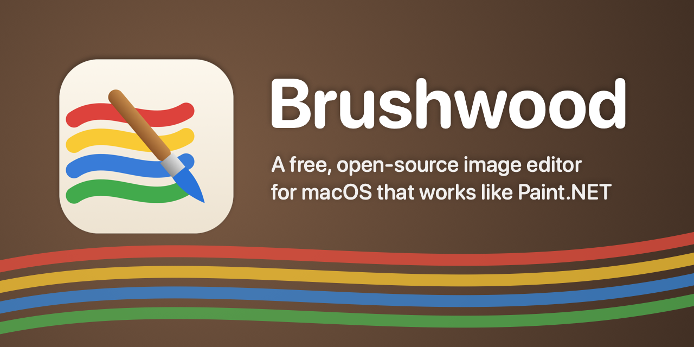
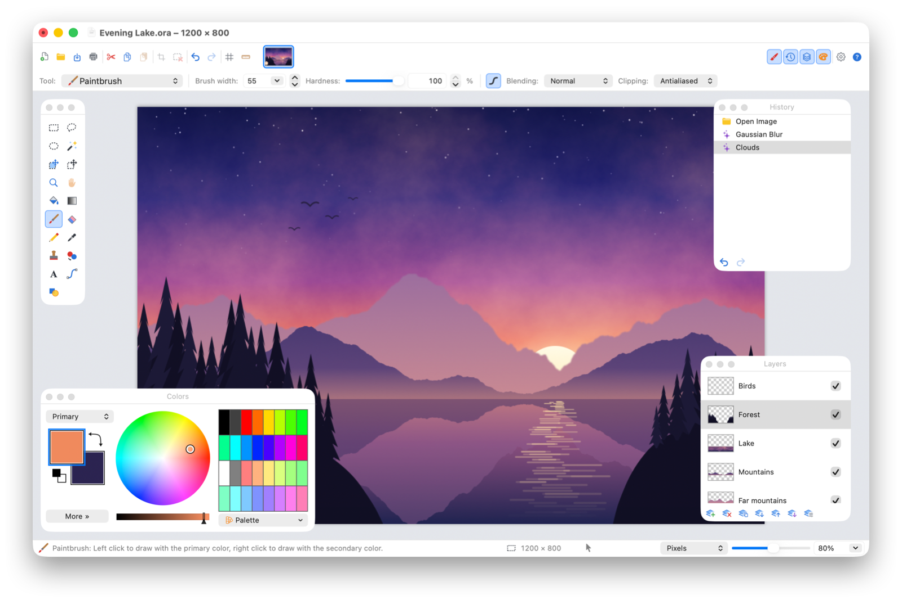
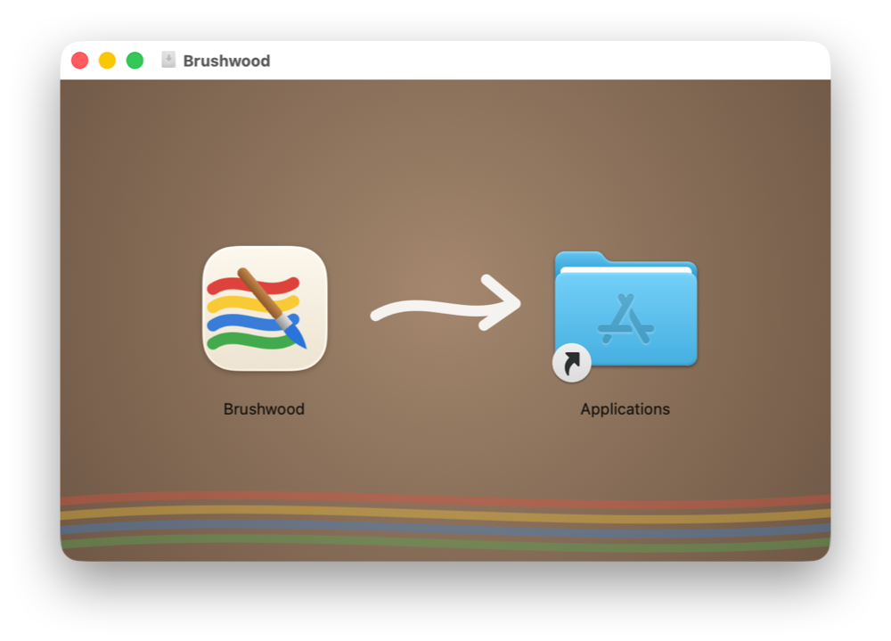
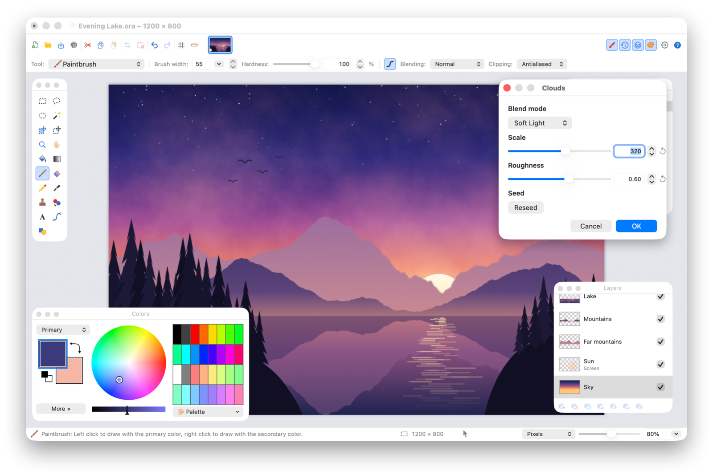
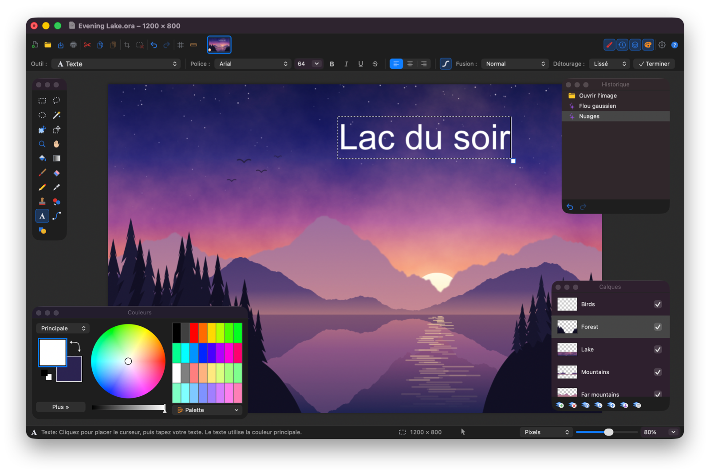

<p align="center">
  
</p>

<p align="center">
  <a href="https://github.com/balaborde/brushwood/releases/latest"></a>
  
  <a href="LICENSE"></a>
</p>

Brushwood brings Paint.NET's workflow to the Mac as a native AppKit application: one main window with image tabs, the four
floating windows (Tools, History, Layers, Colors), layers with blend modes, unlimited history you can click through,
editable shapes and selections, and the full set of Adjustments and Effects with live preview.



> *En bref (FR) :* Brushwood est une alternative libre à Paint.NET pour macOS, écrite en Swift/AppKit. Même organisation
> (fenêtre principale à onglets, fenêtres flottantes Outils/Historique/Calques/Couleurs), mêmes outils, mêmes réglages et
> effets, mêmes raccourcis (Ctrl → ⌘). L'interface est disponible en 12 langues, dont le français. Pour l'installer,
> téléchargez le fichier .dmg de la [dernière version](https://github.com/balaborde/brushwood/releases/latest) et
> suivez les étapes de la section [Installing](#installing).

Brushwood is an independent project. It is not affiliated with or endorsed by dotPDN LLC; "Paint.NET" is a trademark of its
owner. No Paint.NET code, icons or other assets are used — every icon is drawn in code.

## Installing

1. Download **Brushwood-<version>.dmg** from the [latest release](https://github.com/balaborde/brushwood/releases/latest).
2. Open it and drag **Brushwood** onto the **Applications** folder.
3. Eject the disk image, then open Brushwood from Applications or Launchpad.

<p align="center">
  
</p>

Brushwood runs on macOS 13 Ventura or later, on Apple silicon and Intel Macs.

**The first time you open it**, macOS warns that it cannot verify the app, because Brushwood is not signed with a paid
Apple Developer ID. To allow it, once:

- **macOS 15 Sequoia and later:** click **Done**, open **System Settings › Privacy & Security**, scroll down to the
  message about Brushwood, click **Open Anyway** and confirm.
- **macOS 13 Ventura and 14 Sonoma:** Control-click Brushwood in Applications, choose **Open**, then click **Open**.

Alternatively, run `xattr -dr com.apple.quarantine /Applications/Brushwood.app` in Terminal.

**Updating:** choose **Brushwood › Check for Updates…** (or **Settings › Updates**). Brushwood shows what's new, then
downloads the new version, installs it and relaunches. It also checks once a day at launch; this can be turned off in
Settings. Versions without this menu item are updated by installing the new disk image the same way as above.

## Features

<table>
  <tr>
    <td width="50%"></td>
    <td width="50%"></td>
  </tr>
  <tr>
    <td>Every adjustment and effect previews live on the canvas: here Clouds, blended in Soft Light into the Sky layer.</td>
    <td>Light or dark appearance, and an interface in 12 languages: here French, with the Text tool.</td>
  </tr>
</table>

**Window layout (as in Paint.NET)**
- Main toolbar (New, Open, Save, Print, Cut/Copy/Paste, Crop to Selection, Deselect, Undo/Redo, Pixel Grid, Rulers) with
  the image list as thumbnails, and toggles for the floating windows
- Context-sensitive tool bar with the active tool's options
- Floating **Tools**, **History**, **Layers** and **Colors** windows (F5–F8)
- Status bar with tool hint, selection size, cursor position, units and zoom slider
- Rulers, pixel grid, units (pixels / inches / centimeters), checkerboard transparency, drag & drop to open
- Free panning: the image can be moved anywhere in the window, in any direction, at any zoom (Pan tool, Space+drag, middle button,
  trackpad or scroll wheel), until only a small strip of it remains visible
- Tool bar that wraps onto more rows when the window is too narrow for all the options, as in Paint.NET
- Interface in 12 languages: English, Deutsch, Español, Français, Italiano, Nederlands, Polski, Português (Brasil), Русский,
  日本語, 한국어 and 简体中文. Brushwood follows the macOS language; another one can be chosen in **Settings › Language**

**Tools** (same order and letter shortcuts as Paint.NET; pressing a letter again cycles tools that share it)

| Key | Tools |
|-----|-------|
| M | Move Selected Pixels (move, scale with handles, rotate with right-drag, ⌘-drag leaves a copy), Move Selection |
| S | Rectangle Select, Lasso Select, Ellipse Select, Magic Wand |
| Z / H | Zoom, Pan (hold Space anywhere to pan) |
| F / G | Paint Bucket (live: tolerance, fill style and origin stay editable), Gradient (7 types, color/transparency modes, repeat modes, editable handles) |
| B / E / P | Paintbrush (width, hardness, antialiasing, blend mode), Eraser, Pencil |
| K / L / R | Color Picker (sample size, layer/image, after-click action), Clone Stamp (⌘-click sets the source), Recolor |
| T / O | Text (font, size, bold/italic/underline/strikethrough, alignment; editable until finished), Line/Curve (spline handles, dash styles, arrow caps), Shapes (31 shapes, outline/filled/both) |

Selections combine like Paint.NET: ⌘ = union, ⌥ = exclude, right-click = xor, ⌥+right-click = intersect, or pick the mode in
the tool bar. Every tool can use any of the layer blend modes, or **Overwrite**.

**Edit** — undo/redo (or click any step in the History window; click the current step again to compare before/after),
cut, copy, copy merged, paste, paste into new layer / new image, copy and paste the selection outline, erase, fill and
invert selection.

**Layers** — add, delete, duplicate, merge down, toggle visibility, import from file (grows the canvas if needed), flip,
rotate 180°, Rotate/Zoom, go to / move to top, above, below and bottom (or drag in the Layers window), properties (name,
visibility, opacity, blend mode). Blend modes: Normal, Multiply, Additive, Color Burn,
Color Dodge, Reflect, Glow, Overlay, Difference, Negation, Lighten, Darken, Screen, Xor (Paint.NET's set, verified
pixel-exact against Paint.NET renders), plus Hard Light, Soft Light, Color, Luminosity, Hue and Saturation.

**Image** — Crop to Selection, Resize (Best Quality, Supersampling, Bicubic, Bilinear, Lanczos 3, Nearest Neighbor; by
percentage or absolute size, print size), Canvas Size with anchor, Flip, Rotate 90°/180°, Flatten.

**Adjustments** — Auto-Level, Black and White, Brightness/Contrast, Curves (luminosity or per-channel RGB), Exposure,
Highlights/Shadows, Hue/Saturation, Invert Alpha, Invert Colors, Levels, Posterize, Sepia, Temperature and Tint.

**Effects** (all with live preview; ⌘F repeats the last one) — the same menu as Paint.NET 5
- Artistic: Ink Sketch, Oil Painting, Pencil Sketch
- Blurs: Bokeh Blur, Fragment Blur, Gaussian Blur, Median Blur, Motion Blur, Radial Blur, Sketch Blur, Square Blur,
  Surface Blur, Zoom Blur
- Color: Quantize (Octree or Median Cut, dithering)
- Distort: Bulge, Crystalize, Dents, Frosted Glass, Morphology, Pixelate, Polar Inversion, Tile Reflection, Twist
- Noise: Add Noise, Reduce Noise
- Object: Drop Shadow, Feather, Outline Object
- Photo: Glow, Red Eye Removal, Sharpen, Soften Portrait, Straighten, Vignette
- Render: Clouds, Julia Fractal, Mandelbrot Fractal, Turbulence, Voronoi Diagram
- Stylize: Edge Detect, Emboss, Outline, Relief

**Colors** — primary/secondary colors, HSV wheel, 96-color palette (Paint.NET's default; load/save Paint.NET `.txt`
palettes), hex/RGB/HSV/alpha controls.

**Files**

| Format | Open | Save | Notes |
|--------|:----:|:----:|-------|
| Paint.NET `.pdn` | ✓ | ✓ | Default for layered images. Layers, names, opacity, visibility and blend modes |
| OpenRaster `.ora` | ✓ | ✓ | Layered format also read by Krita, GIMP and MyPaint; keeps the extra blend modes |
| PNG, JPEG, BMP, GIF, TIFF, TGA, DDS, HEIC, AVIF, ICO | ✓ | ✓ | Quality / bit depth options, live file-size estimate |
| WebP, JPEG XL, PSD (flattened) | ✓ | | via ImageIO |

Clipboard (copy, copy merged, paste, paste into new layer / new image), printing, recent files and unsaved-changes
prompts are supported.

**Updates** — Brushwood › Check for Updates… finds a newer release on GitHub, shows its notes, then downloads it, checks
it against GitHub's checksum, replaces the app and relaunches. Brushwood connects to the internet only for this: to
api.github.com when checking (at most once a day at launch, which can be turned off in Settings › Updates) and to GitHub
when downloading an update.

## Requirements

- macOS 13 Ventura or later (Apple silicon or Intel)
- To build: Swift 5.9+ (the Xcode Command Line Tools are enough — a full Xcode install is not required)

## Building

```sh
scripts/build-app.sh          # builds build/Brushwood.app (release)
open build/Brushwood.app
```

During development you can also run `swift run Brushwood`.

The app is signed ad hoc. The first time you open a copy downloaded from elsewhere, macOS asks you to allow it (see
[Installing](#installing)).

### Release disk image

```sh
scripts/make-dmg.sh           # builds build/Brushwood-<version>.dmg (Apple silicon + Intel)
```

The version comes from `CFBundleShortVersionString` in `Resources/Info.plist`. The disk image opens on a window where
the app is dragged onto Applications; Finder lays that window out, so the first run asks to let the terminal control
Finder. Attach the .dmg to a GitHub release.

For **Check for Updates…** to find a release, publish it on GitHub with:

- a tag `v<version>`, where `<version>` is the app's `CFBundleShortVersionString` (for example `v1.0.2`);
- the disk image attached (the first `.dmg` file of the release is the one installed);
- release notes in Markdown: Brushwood shows them in its update window, up to a heading that starts with "Install"
  (download instructions are not needed there).

Increase `CFBundleVersion` (the build number) by one for each release as well. To try the updater without publishing,
point it at a local copy of the GitHub API's answer: `BRUSHWOOD_UPDATE_FEED=file:///path/to/release.json`.

With a paid Apple Developer account, the app and the disk image can be signed with a Developer ID and notarized, so
macOS opens Brushwood without the first-launch warning:

```sh
xcrun notarytool store-credentials brushwood      # once: saves the Apple ID and app-specific password
DEVELOPER_ID="Developer ID Application: Name (TEAMID)" NOTARY_PROFILE=brushwood scripts/make-dmg.sh
```

### README pictures

```sh
scripts/make-readme-images.sh # regenerates docs/images: the banner and the screenshots
```

The screenshots are real captures of Brushwood editing a demo picture drawn by `scripts/readme-images.swift`. The terminal
needs Screen Recording permission, and the app appears on screen for a few seconds per picture: leave the Mac alone
meanwhile, since its floating windows hide when another app becomes active. Your own Brushwood settings are restored
afterwards. When `build/Brushwood-<version>.dmg` exists, the disk image's install window is captured too.
`docs/images/banner.png` (1280 × 640) can also serve as the repository's social preview, set in the repository's
**Settings › General › Social preview** on GitHub.

## Keyboard shortcuts

Paint.NET's shortcuts with Ctrl mapped to ⌘. Where macOS reserves a key, Brushwood uses an alternative:

| Command | Paint.NET | Brushwood |
|---------|-----------|-----------|
| Rotate 90° clockwise | Ctrl+H | ⌃⌘H (⌘H hides the app) |
| Merge Layer Down | Ctrl+M | ⌃⌘M (⌘M minimizes) |
| Layer Rotate/Zoom | Ctrl+Shift+Z | ⌥⌘Z (⇧⌘Z is Redo) |
| Redo | Ctrl+Y | ⇧⌘Z or ⌘Y |
| Toggle Layer Visibility | Ctrl+, | ⌃⌘, (⌘, opens Settings) |
| Erase / Fill Selection | Delete / Backspace | ⌫ / ⇧⌫ |

The complete list is under **Help › Keyboard Shortcuts**.

## Project layout

```
Sources/BrushwoodCore/     Pixel engine (no UI): surfaces, layers, blend modes, selections, history,
                           flood fill, resampling, adjustments & effects, file formats (PDN read/write, ORA, ImageIO)
Sources/Brushwood/         AppKit application
  App/                     app delegate, menus, main window controller, documents, effects plumbing
  Canvas/                  tiled canvas view and renderer
  Tools/                   the 19 tools
  Panels/                  Tools, History, Layers and Colors windows
  Chrome/                  toolbars, status bar, icons, shared controls
  Dialogs/                 effect dialogs (auto-generated), Curves, Levels, New/Resize/Canvas Size, etc.
Resources/                 Info.plist and localizations (*.lproj, generated by scripts/gen_strings.py)
Tests/SelfTest/            engine test suite
docs/images/               pictures used in this README (generated by scripts/make-readme-images.sh)
scripts/                   app bundling, release disk image, README pictures, UI smoke tests, localization generator
```

Pixels are stored as straight-alpha BGRA like Paint.NET's `ColorBgra`. Blend modes, flood-fill tolerance and the main
adjustments (Brightness/Contrast, Hue/Saturation, Levels, Sepia, Posterize…) follow Paint.NET's published 3.x algorithms.

## Testing

```sh
swift run -c release selftest          # engine tests (blend modes, selections, flood fill, history, formats, effects)
swift run -c release selftest <dir>    # also checks .pdn decoding and blend modes against Paint.NET reference renders
                                       # (FlattenBlendTest.pdn + Flatten*Test.png from the pypdn project)
scripts/ui-smoke-test.sh               # drives the app through scripted scenarios and checks the resulting pixels
scripts/screen-check.sh                # opens a test image and checks what is really on screen
                                       # (needs Screen Recording permission for the terminal)
```

The UI tests use a private pasteboard, so they never touch your clipboard.

## Localization

Strings are written in English in the source (`L("…")`). Each language has a table in `scripts/translations/<code>.py`
with one `English source string|translation` per line. After changing strings in the source or a table, run
`python3 scripts/gen_strings.py`: it regenerates `Resources/<code>.lproj/Localizable.strings`, lists untranslated strings and
rejects translations whose `%@` / `%d` placeholders differ from the English ones.

To add a language, copy a table to `scripts/translations/<code>.py`, translate the right-hand sides, then add the code to
`CFBundleLocalizations` in `Resources/Info.plist` and to `AppLanguage.available` in `Sources/Brushwood/App/AuxWindows.swift`.

## Known differences from Paint.NET

- `.pdn` files are written with the same object graph and chunked pixel layout as Paint.NET 4.21 (checked record by
  record against files saved by Paint.NET), but they have not been opened in Paint.NET itself during development. The six
  extra blend modes are saved as Normal in `.pdn` (Brushwood warns and suggests OpenRaster).
- Several effects (for example Ink Sketch, Dents, Frosted Glass, Vignette, the Paint.NET 5 additions such as Bokeh Blur,
  Sketch Blur, Crystalize or Turbulence, and the Object effects) are reimplementations of the documented behaviour, not
  exact ports, so their output can differ from Paint.NET's.
- Selection handles of Move Selected Pixels follow the axis-aligned bounds (Paint.NET rotates them with the content).
- Not implemented: plugins, tablet pressure, Image › Color Profile, and File › Acquire (scanner/camera).
- Menus live in the macOS menu bar rather than inside the window, and a few shortcuts differ where macOS reserves the key
  (see the table above).

## Contributing

Bug reports, translation fixes and pull requests are welcome: see [CONTRIBUTING.md](CONTRIBUTING.md). Most translations
have not been reviewed by native speakers yet, so corrections in your language help a lot.

## License

MIT — see [LICENSE](LICENSE).
